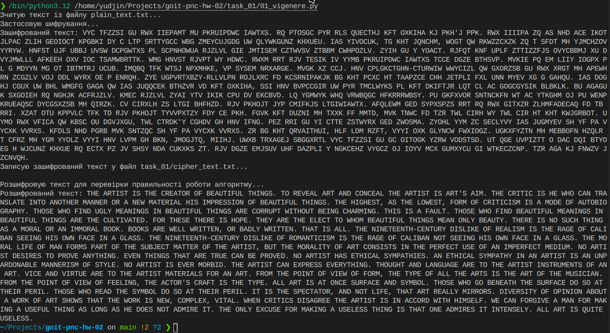
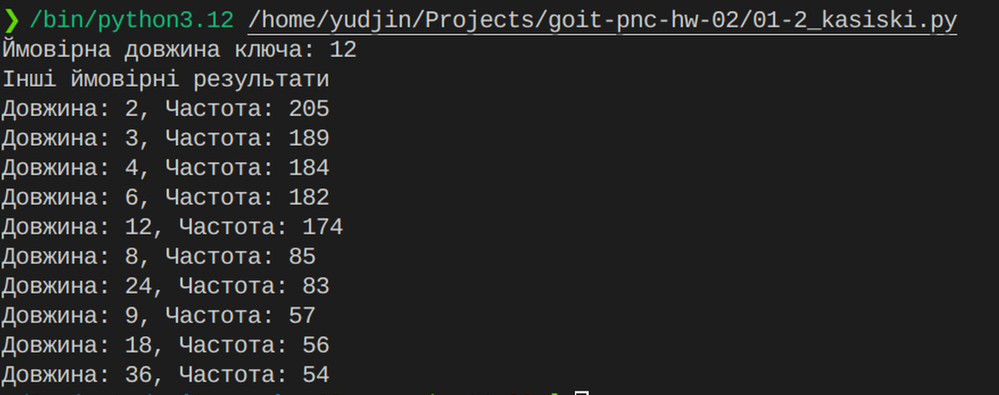
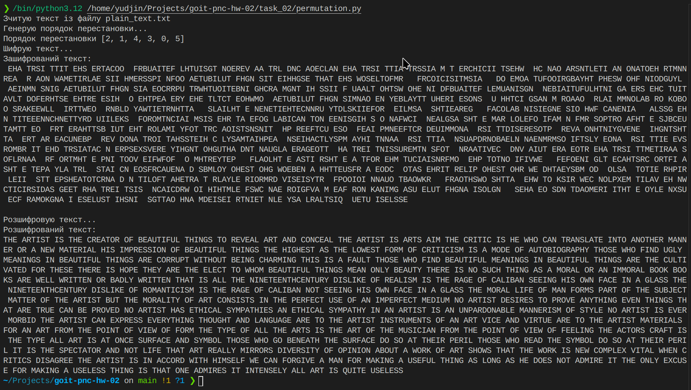
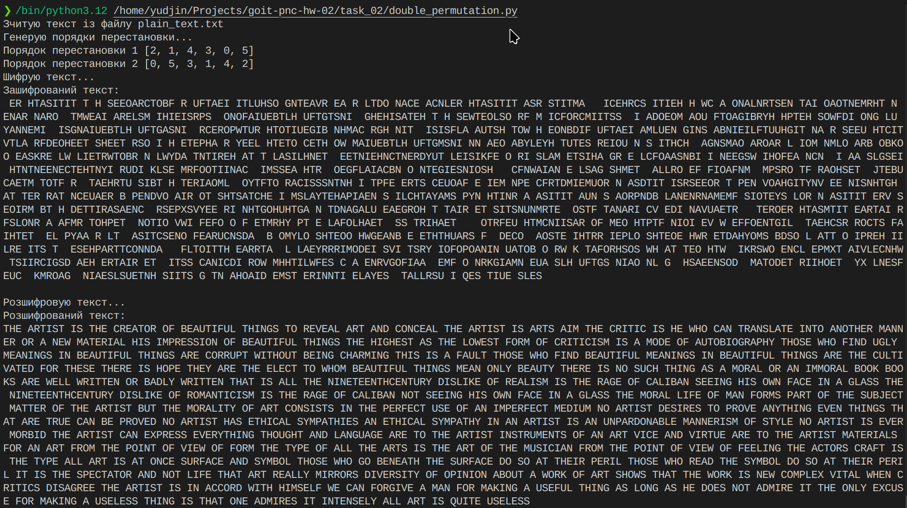
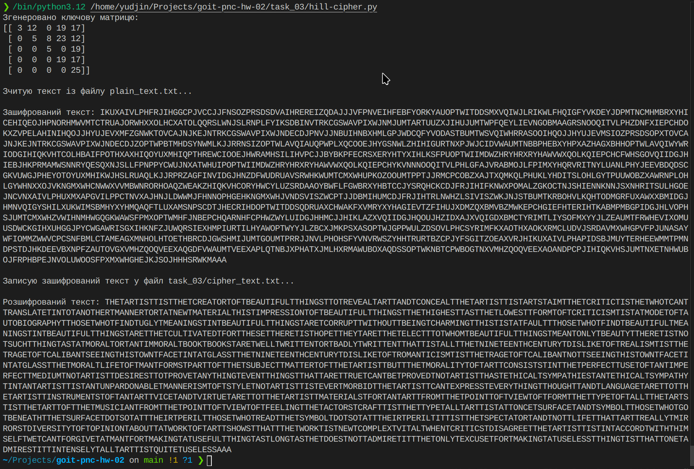
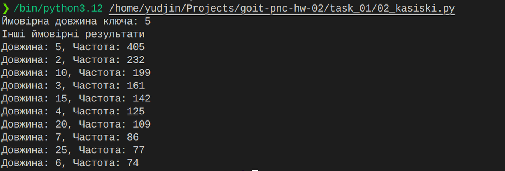

# goit-pnc-hw-02
Домашнє завдання до теми "Історія та приклади криптографічних перетворень"

## Завдання 1
При запуску скрипта `task_01/01_vigenere.py` виконується зчитування тексту із файла `plain_tetx.txt`. Текст шифрується за допомогою алгоритма Віженера ключем `CRYPTOGRAPHY`
 і записується у зашифрованому вигляді у файл `cipher_text.txt`. Зашифрований текст також розшифровується і виводиться на стандартний вивід, щоб можна було переконатись, що алгоритм працює правильно.

При спробі реалізації тесту Касіскі я зустрівся із складнощами визначення ймовірної довжини ключа. При пошуку рішень я перевіряв вплив різних факторів на результати тесту, таких як довжина та якість плеінтексту, довжина ключа і навіть варіанти реалізації тесту. Для того щоб добитися надійної роботи тесту, довелося застосувати фільтр результатів. Суть роботи фільтру полягає у тому що він визначає довжину найбільшої підстроки із суттєвою частотою появи, кратну довжинам всіх інших підстрок із більшими частотами. Фільтр реалізовано у функції `filter_divisors()` . Фільтр показав гарні результати на різних зразках тексту та ключах різної довжини.
Результат роботи скрипта:

Після визначення довжини ключа шифру Віженера, стає можливим застосування частотного аналізу для знаходження значення ключа та розкриття криптограми.

## Завдання 2

### permutation.py

### double_permutation.py
Для подвійної перестановки я використав функції із файлу `permutation.py`
Довелося додати до функції decrypt додаткову перевірку на довжину блоків, щоб вона коректно працювала із повторною розшифровкою.

## Завдання 3
Під визначення “табличний шифр” може підпадати ціла категорія різних алгоритмів. Я вирішив реалізовувати класичний варіант - .
Шифр Гілла оперує квадратною ключовою матрицею, а також матрицями-векторами, що утворюються із блоків плейнтексту. Шифрування відбувається за рахунок перемноження цих матриць. Для розшифровки потрібно буде розбити криптограму у вектори і перемножити їх із матрицею, оберненою до ключової.

Цікавою задачею тут виявилось генерування ключової матриці. Це має бути квадратна матриця, оборотна за модулем 26 (кількість елементів алфавіту). Детермінант такої матриці повинен бути не 0, не ділитися на 2 чи 13. Ця матриця має залежати від ключового слова. 

Такі властивості гарантовано матиме трикутна матриця, діагональ якої складається із чисел взаємно простих із 26.  Я заповнив діагональ псевдовипадковими числами, які задовольняли цю вимогу, попередньо встановивши seed на основі ключового слова. Верхній трикутник матриці я заповнив елементами ключового слова. Це реалізовано у функції `generate_key_matrix()`

Другою цікавою задачею виявився пошук оберненої матриці за модулем 26. `np.linalg` чомусь давав неправильний результат, тому довелося писати саморобну функцію `mod_matrix_inverse()`.

Із цікавості я спробував застосувати до криптограми Гілла тест Касіскі.

Як бачимо, тест Касіскі не зміг правильно визначити довжину ключа. Тобто шифр Гілла, як і очікувалось, є стійким до аналізу цього типу.
